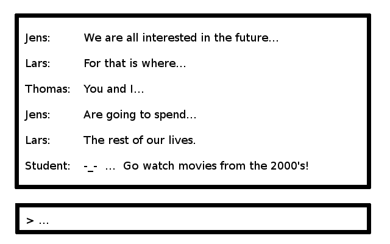

# CA-1: Chat service

For this CA you must write a simple TCP chat service (server and client) and deploy it on a globally
accessible server.

The CA must also expose a simple website where the chat client can be downloaded and where we can
find all required documentation (see below). This website must be secured with HTTPS.

## Deadlines

1. Present your progress to us on **Wednesday the 15th** between 8:30 and 12:00.
2. Test your client against the server from another team, and your server against a client from another team at the last on **Friday the 17th**. This has to go in the documentation.
3. **The assignment must be handed in by Sunday 19th of February at 23:59!**

## The chat protocol
The chat system must use a protocol to communicate with the client and server. This protocol have been defined
in the class on the 13th of February and can be found here: [https://github.com/CphBusCosSem3/Exercises/blob/master/CA/CA1/protocol.md](https://github.com/CphBusCosSem3/Exercises/blob/master/CA/CA1/protocol.md)

Following and implementing this protocol is the most important part of this assignment.
If your server does not obey this protocol, it will not be accepted as a valid solution!

## The server
The server must be written in Java and use a simple TCP connection to receive and send messages. The server
should listen for connections on port 8081.

All connections should be handled **asynchronously** so the server does not block. 

The server must be wrapped in a ``.jar`` file and deployed on a globally accessible server (such as 
Digital Ocean).

## The client
The client must be written in Java and, like the server, implement the chat protocol. The client must contain
two parts:

1. A non-GUI TCP client which can receive and send messages, _independently_ of the GUI.
This part _must not block_ when sending messages.
2. A GUI in Swing where the user can interact with the service. The GUI must provide a way to view previous
messages and send new ones. As inspiration, your layout could look like the one in Figure 1.

## The Web server
Apart from the server and client, we require you to include four things:

1. A main page (``index.html``) with links to the below
2. A link to your documentation, written in HTML
3. A link to the source code (on a git portal)
4. A link to a downloadable client as a ``.jar`` file.

This must be implemented using Tomcat with JSP server pages and should listen on port 8080. As with the chat server
this must be deployed on Digital Ocean.

In the documentation we need to know who wrote what because we need to distribute study points to the individual
members in the group.

### The reverse proxy
The web server must be secured with HTTPS using a reverse proxy (Nginx). We want you to deploy the proxy in front of the
web server so it can verify the traffic and relay the connection to your actual web server, deployed by Tomcat. 

So your reverse proxy should handle incoming connections to the web server on port 443 (HTTPS) and forward them
to Tomcat. Connections to port 80 (regular HTTP) is unsafe and should receive a ``301 Moved Permanently`` HTTP
status message, along with a forward to port 443.

For this task you will need a certificate to make sure you are who you say you are. 
One way of getting such certificate is to use [Let's encrypt](https://letsencrypt.org).

I wrote a guide to Nginx and what it is all about here: [https://github.com/CphBusCosSem3/week2-network/blob/master/nginx.md](https://github.com/CphBusCosSem3/week2-network/blob/master/nginx.md). It gives some pointers on what we went through in
the last weeks and hopefully makes it all easier to understand.

## Test requirements
Your chat server, chat client and tomcat system should be tested

* For the server, you need to start it in a separate thread and test that all the commands in the protocol
gives you the expected result.
* For the client, you need to simulate a server in a separate thread and test that the client are sending
the right commands.
* For the web server you need to spin up a Tomcat server and test that you are getting the expected
``HTML`` for each REST entry point.

## What to demonstrate and hand in
**The assignment must be handed in by Sunday 19th of February at 23:59!** Hand-in should be sent to ``iwantstudypoints@gmail.com`` and contain a link to your documentation. 

### Requirements

#### Project requirements

* The chat server must be demonstrated against your own client + a client from at least one other team. The server
must be deployed on Digital Ocean.
* The chat client must be demonstrated against your own server + a server from at least one other team
* The code must be available on a git server (such as GitHub or Bitbucket)
* The code, documentation and runnable client (as a ``.jar`` file) must be available on your website, as published on your Digital Ocean server
* Your project must be a runnable Maven project (with no compile errors :-) so we can run your tests

#### Documentation requirements
You must include documentation available via your web server containing:

* Documentation for your tests againts another teams client and server including a description on what went well and what did not
* A description on how you designed the system
* A description on how to use the system
* A section stating who worked on what in your group
    
Apart from that we would love to hear about:

* Your opinions about good or bad things about this flow. What was good and what was bad?
* Your thoughts on what you did different from your last semester to better learn the course material we gave you

Please make sure to include a link to the git repository for the chat server, web server and client code.

## How to spend your four days
You are supposed to develop the system over 2 consecutive two-day mini sprints as sketched below:

* Day 1-2: Concentrate on developing a chat server which can handle at least two clients. Before the end of
day 2 you should demonstrate your server to us!
* Day 3: Concentrate on writing your client and make sure you can connect to your server with multiple clients.
* Day 4: Re-visit your Tomcat server and Nginx proxy and setup the reverse proxy from Nginx to Tomcat.
Try to get to a point where you can deploy your chat server to Digital Ocean. 

## Study points for this flow
You can earn a maximum of 40 study points in this period. Remember that you __need at least 80% to be
allowed to enter the exam__!

| Activity | Study points reward |
| ---- | ---- |
| Participation in the class | 11 points |
| Friday study point exercises | Up to 10 points |
| For your contribution to the code and documentation | Up to 5 points |
| For the demonstration of the server on day 2 | Up to 4 points |
| The quality of your code and coverage of your tests | Up to 5 points |
| For the demonstration of your system in day 4 and the quality of the documentation | Up to 5 points |
| **Extra** For giving us constructive feedback on flow 1 | Up to 3 points |
| **Extra** For helping to improve the course material by pointing out errors and pull requests | Up to 2 points |

## Bonus study points
While you develop this system you will acquire knowledge about many small details, which might have taken
you a lot of time to figure out. 
Try using this knowledge to help each other. If you have a problem, ask out in the class if anyone can help you
(and respect if the reply is _no_ or _wait_).

**Remember** that you can earn up to **2** study points for giving helping us improve the course material. This is
additional to the 40 points of the module. So you can actually get more than a 100%.

## If you are lost
If you are lost on what to do, try spending at least 15 minutes trying to find the answer for yourself. First
find out what your problem is. What are you trying to solve? Figure out this question before you go asking
others!

If you spent 15 minutes for yourself, then try asking around in the class. If you are stuck, others have
most likely also been stuck!

If no one replies, send a mail to us. If you are stuck for more than 30 minutes you should ask someone
regardless! Getting stuck can be helpful - but only for a little while. Getting stuck for a long time
prevents you from learning!
