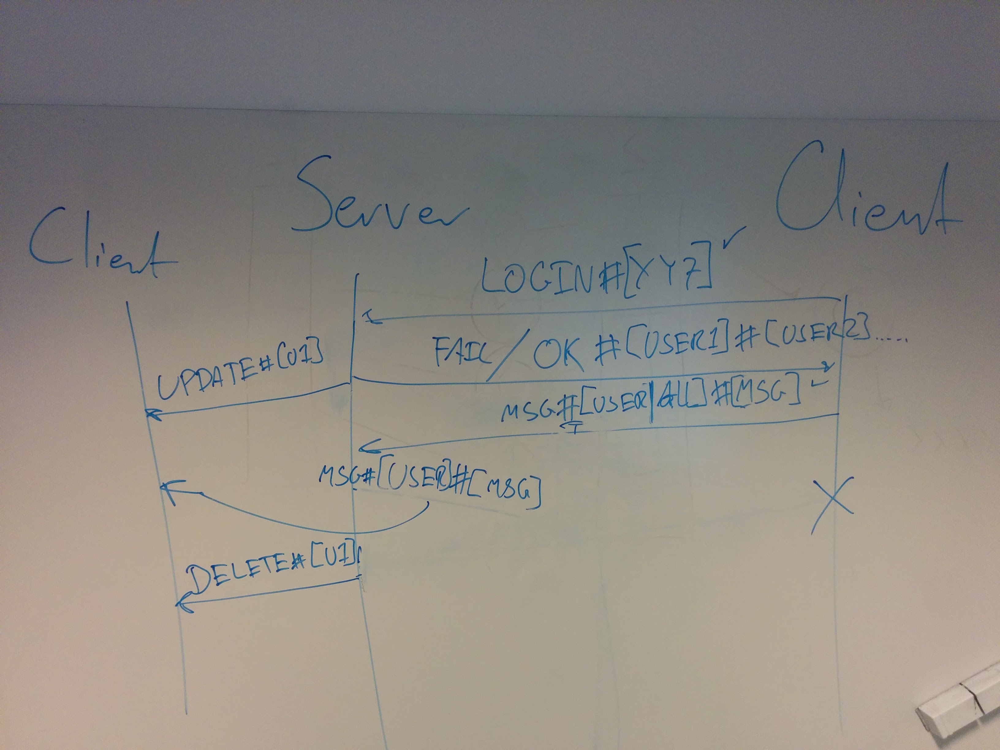

# Chat protocol for CA1

This protocol was defined by the students in the class on the 13th of February.
You are expected to implement this protocol both on the server and the client,
to allow them to communicate. In the client -> server section, the client sends
commands to the server which the server reacts upon. In the server -> client
section, the server sends messages to all the clients currently logged in.

**Convention** 

1. All commands must be in one line and end with a newline ``\n`` character1
2. No names with ``#`` and no messages with ``#``

In the text below the values inside ``[]`` is meant to be replaced by a variable. So ``LOGIN#[USERNAME]`` would be ``LOGIN#Lars`` if your user name is "Lars".

## Client -> Server
These messages should arrive _to_ the server _from_ the client.

| Command | Description | Definition | Examples |
| ------- | ----------- | ---------- | -------- |
| Login   | Logs in the client by adding it to the list of participants in the chat room | ``LOGIN#[USERNAME]`` | ``LOGIN#Lars`` |
| Message | Sends a message to either everyone the chat room (``ALL``) or a single client (in this case ``USERNAME`` is the **receiver**) | ``MSG#[USER|ALL]#[MESSAGE]`` | ``MSG#Lars#Hej``, ``MSG#ALL#Hej`` |

Logging out a client should be discovered by the server when the TCP connection breaks. That should trigger a ``DELETE`` message sent from the server to all the remaining clients.

## Server -> Client
These messages should arrive _to_ the client _from_ the server.

| Command | Description | Definition | Examples |
| ------- | ----------- | ---------- | -------- |
| Ok | Successful login followed by list of active user names | ``OK#[USER1]#[USER2]#...`` | ``OK#Lars#Jens#Donald`` |
| Fail | Failed login if user name is already taken or connection error | ``FAIL`` | ``FAIL`` |
| Update client list | Update all clients when a single new user logs in | ``UPDATE#[USERNAME]`` | ``UPDATE#Lars`` |
| Forward message | Forwards message from a client (``USERNAME`` is now the **sender**) | ``MSG#[USERNAME]#[MESSAGE]`` | ``MSG#Jens#Hej`` |
| Delete user from chat | Tells all clients that a user has disconnected | ``DELETE#[USERNAME]`` | ``DELETE#Lars`` |

## Image from class

1 Protip: Use a ``PrintWriter`` to output your data to the socket ``OutputStream``. It has the ``println`` method which prints your message in a single line, ending with a newline character (``\n``). Similarly you can use a ``BufferedReader`` in the receiving end which has the ``readLine()`` method, which reads text from the socket until a newline character (``\n``).
